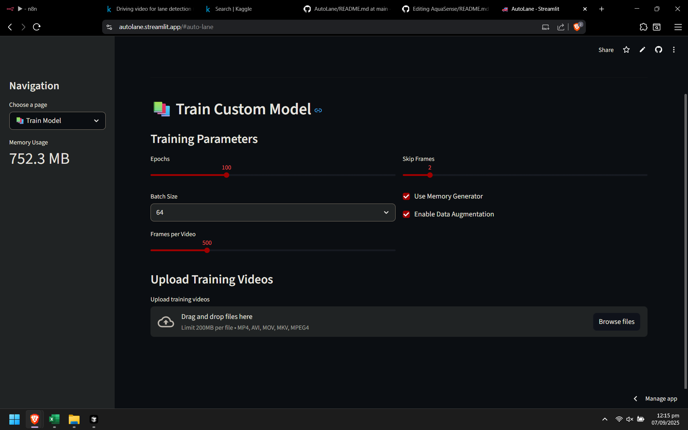

# 🚗 AutoLane - Advanced Lane Detection System with Deep Learning

AutoLane is a state-of-the-art lane detection system that uses custom-trained Convolutional Neural Networks (CNNs) to accurately identify and track lane markings in real-time. Built with TensorFlow/Keras and featuring a modern Streamlit web interface, AutoLane provides both training capabilities and real-time prediction for images and videos.


## ✨ Features

### 🎯 **Core Capabilities**

- **Real-time Lane Detection** using custom-trained CNN models
- **Multi-format Support** for images (JPG, PNG, BMP) and videos (MP4, AVI, MOV, MKV)
- **Custom Model Training** with your own datasets
- **Advanced Data Augmentation** for improved model performance
- **Memory-optimized Processing** for large datasets

### 🖥️ **User Interface**

- **Modern Streamlit Web App** with intuitive navigation
- **Real-time Progress Tracking** for video processing
- **Interactive Analytics Dashboard** with training metrics
- **Model Comparison Tools** for performance evaluation
- **Download Capabilities** for processed results

### 🧠 **AI/ML Features**

- **U-Net Architecture** for precise lane segmentation
- **Binary Cross-entropy Loss** optimized for lane detection
- **Advanced Callbacks** including early stopping and learning rate scheduling
- **Comprehensive Evaluation Metrics** (Accuracy, IoU, Loss tracking)
- **TensorBoard Integration** for training visualization

## 🚀 Quick Start

### Prerequisites

- Python 3.8 or higher
- 8GB+ RAM recommended
- GPU support (optional but recommended for training)

### Installation

1. **Clone the repository**

   ```bash
   git clone https://github.com/iamdheerajjain/autolane.git
   cd autolane
   ```

2. **Install dependencies**

   ```bash
   pip install -r requirements.txt

3. **Model Training**

   ```bash
   python training.py --videos "Videos/*.mp4" --epochs 50 --batch_size 8 --frames_per_video 100 --augment --use_generator
   ```

4. **Model Prediction**

   ```bash
   python prediction.py --input "path/of/video" --output "demo_output.mp4" --model "checkpoints/custom_lane_model_best.h5"
   ```

## 🌐 **Web Interface (Recommended)**

1. **Launch AutoLane**

   ```bash
   python run_streamlit.py
   ```

2. **Navigate the Interface**

   - **🏠 Home**: System overview and quick start
   - **🎯 Predict**: Upload and process images/videos
   - **📚 Train Model**: Train custom models with your data
   - **📊 Analytics**: View training metrics and model performance
   - **⚙️ Settings**: Configure system parameters

3. **Process Media**
   - Upload images or videos through the web interface
   - Select a trained model
   - Download processed results with lane detection overlays


## 🧠 Model Architecture

AutoLane uses a custom U-Net architecture optimized for lane detection:

- **Encoder-Decoder Structure** with skip connections
- **Input Resolution**: 160×320×3 (configurable)
- **Output**: Single-channel binary mask
- **Activation**: Sigmoid for binary segmentation
- **Loss Function**: Binary Cross-entropy
- **Optimizer**: Adam with learning rate scheduling

### **Training Features**

- **Data Augmentation**: Horizontal flips, brightness/contrast adjustment, noise injection
- **Memory Optimization**: Efficient data generators for large datasets
- **Advanced Callbacks**: Early stopping, model checkpointing, learning rate reduction
- **Comprehensive Logging**: CSV logs and TensorBoard integration

## 📊 Performance Metrics

AutoLane provides comprehensive evaluation metrics:

- **Accuracy**: Overall pixel classification accuracy
- **Binary Accuracy**: Lane vs. non-lane classification
- **Mean IoU**: Intersection over Union for lane regions
- **Loss Tracking**: Training and validation loss curves
- **Processing Speed**: FPS metrics for real-time applications

## ⚙️ Configuration

### **Model Settings**

- Input shape: 160×320, 240×480, or 320×640
- Confidence threshold: 0.1 - 0.9
- Memory usage limits: 1GB - 8GB

### **Training Parameters**

- Epochs: 10 - 300
- Batch size: 16, 32, 64, 128, 256
- Frames per video: 50 - 2000
- Skip frames: 1 - 10

## 🔧 Advanced Usage

### **Custom Training**

1. **Prepare Your Dataset**

   - Place training videos in the `Videos/` directory
   - Videos should contain clear lane markings
   - Supported formats: MP4, AVI, MOV, MKV

2. **Configure Training Parameters**

   - Use the Streamlit interface or command line
   - Adjust epochs, batch size, and data augmentation
   - Monitor training progress with real-time metrics

3. **Evaluate Model Performance**
   - View training curves in the Analytics page
   - Compare multiple models
   - Export training logs for analysis


## 🐛 Troubleshooting

### **Common Issues**

1. **"Model not found" Error**

   - Ensure you have a trained model in `checkpoints/`
   - Train a model first using the Training page

2. **Memory Issues**

   - Reduce batch size or frames per video
   - Enable memory generator in training settings
   - Close other applications to free RAM

3. **GPU Not Detected**

   - Install CUDA-compatible TensorFlow
   - Check GPU drivers are up to date
   - Verify GPU memory availability

4. **Video Processing Errors**
   - Check video format compatibility
   - Ensure sufficient disk space in `outputs/`
   - Verify video file integrity

### **Performance Optimization**

- **For Training**: Use GPU acceleration and memory generators
- **For Inference**: Reduce input resolution for faster processing
- **For Large Datasets**: Use data augmentation and batch processing

## 📸 Output Preview




